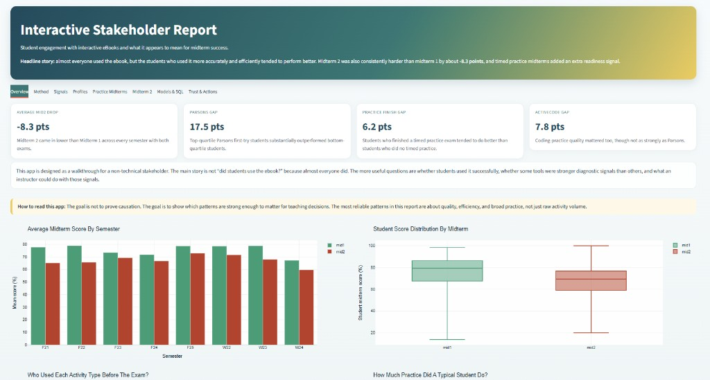
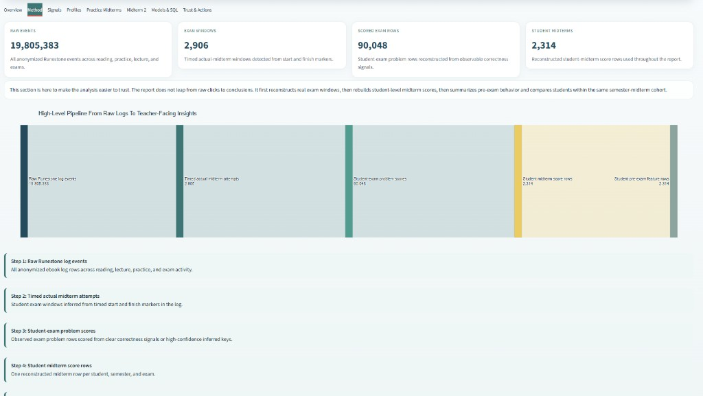
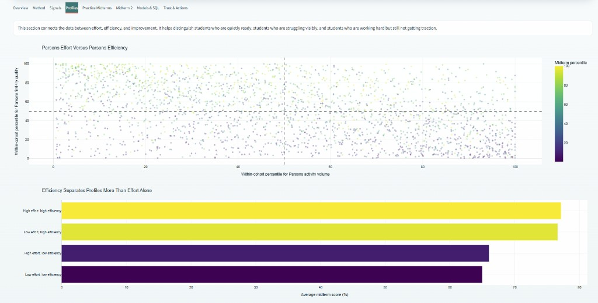

# Student engagement with interactive eBooks

This is the UMSI SO-ELL analysis of anonymized Runestone logs from an intermediate Python course (SI 206 / SI 201). The question is pretty simple: **what kinds of ebook practice actually line up with midterm scores?**

Almost everyone used the book, so "did they click?" is not a useful split. Quality is. The cleanest signal we found is first-attempt Parsons success: students in the top quartile scored about **17.5 points** higher than the bottom quartile in the same semester and exam.

## Stakeholder dashboard (Streamlit)







### Can someone run the app from the GitHub repo?

**Yes.** The Streamlit app does **not** need `runestone_event_log.parquet`. It reads the precomputed tables in `analysis_outputs/` (including `student_midterm_scores.parquet` and `student_midterm_activity_features.parquet`).

From this folder (or from `updated-v2/` in the [runestone](https://github.com/ojhnny/runestone) repo):

```bash
pip install -r requirements.txt
python -m streamlit run streamlit_dashboard.py
```

On Windows PowerShell, the same commands work. Then open the URL Streamlit prints (usually `http://localhost:8501`).

You only need the raw event log if you want to **rebuild** scores from scratch (`python -m ebook_analysis --rebuild-scores`). That file stays local and should not be committed.

## What's in here

```
runestone_event_log.parquet   19.8M anonymized ebook events (local only)
exam_windows/                 timed midterm start/finish windows
analysis_outputs/             reconstructed scores and pre-exam features
sql/                          DuckDB queries over the event log
ebook_analysis/               scoring, SQL runner, stats, Looker export
rebuild_midterm_scores.py     rebuild exam scores from the raw log (slow)
streamlit_dashboard.py        interactive stakeholder readout
looker_studio/                aggregate CSVs to upload to Looker Studio
notebooks/                    SQL, features, and model walkthroughs
tests/                        parser and cohort-stat tests
docs/screenshots/             Streamlit dashboard snapshots
feature_dictionary.md         what each pre-exam feature means
looker_studio_guide.md        which CSVs to upload and how to chart them
resume_bullets.md             copy-paste resume bullets
```

This folder is the project. Run commands from here, not from the repo root.

The 19.8M-row event file (`runestone_event_log.parquet`) is local-only. Don't commit it.

## How to rerun

```bash
python3 -m venv .venv
source .venv/bin/activate   # Windows: .\.venv\Scripts\Activate.ps1
pip install -r requirements.txt

# unit tests, no data needed
python -m pytest tests -q

# SQL features + regressions + Looker tables
# (needs runestone_event_log.parquet and analysis_outputs/)
python -m ebook_analysis
```

If you ever need to rebuild midterm scores from scratch:

```bash
python -m ebook_analysis --rebuild-scores    # walks the full log; takes a while
```

Then start the Streamlit report:

```bash
python -m streamlit run streamlit_dashboard.py
```

(`make test` / `make features` / `make app` work the same on Mac/Linux if `make` is installed.)

## Method, short version

1. Timed exam windows come from start/finish markers in the log (`exam_windows/`).
2. Midterm scores are reconstructed from correctness flags and, for a few item types, inferred keys.
3. Pre-exam features only use events **before** that student's exam start.
4. Comparisons are within `(semester, midterm)` so we aren't mixing easier and harder exams.
5. The follow-up models add cohort fixed effects, effort controls, and a leave-one-semester-out at-risk baseline.

None of this is causal. Students who get Parsons right on the first try are probably already stronger. The point is that the log gives instructors an early, specific signal.
